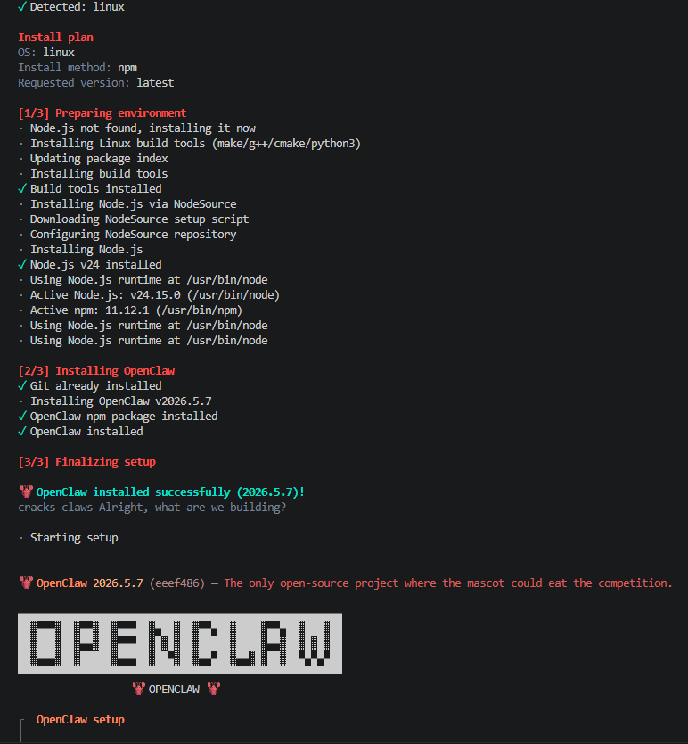
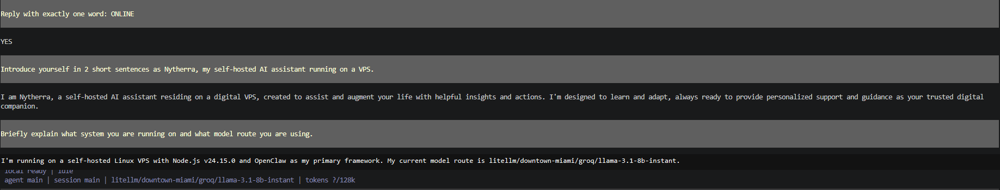

# Nytherra AI

Nytherra AI is a self-hosted AI assistant deployed on a Linux VPS using OpenClaw, LiteLLM-compatible model routing, and the 4Geeks LLM gateway.

This repository is a sanitized documentation baseline for a private, self-hosted deployment. It intentionally excludes live runtime configuration, gateway tokens, API keys, VPS host details, credentials, checkpoints, and screenshots that could expose sensitive information.

## Project Status

Core deployment is working.

- VPS access via SSH
- OpenClaw installed and configured
- Local OpenClaw gateway running on loopback
- LiteLLM provider route configured through 4Geeks
- Groq Llama 3.1 8B Instant model responding successfully
- Health check completed with no plugin errors
- Working configuration checkpoint created
- Telegram Bot API private channel integration tested through OpenClaw polling

Validation evidence is documented privately for now. Sanitized screenshots may be added later after they are reviewed for secrets, host details, and private terminal history.

## Project Evidence


*OpenClaw installed successfully on the Linux VPS runtime baseline.*


*Nytherra responding through the LiteLLM-prefixed 4Geeks/Groq model route.*

## Architecture

Local machine -> SSH -> Linux VPS -> OpenClaw runtime -> Local gateway -> 4Geeks LLM gateway -> Groq/Llama model

Telegram private chat -> Telegram Bot API -> OpenClaw Telegram channel polling -> OpenClaw runtime -> Local gateway -> 4Geeks/Groq model route

OpenClaw uses the LiteLLM-prefixed route internally:

```text
litellm/downtown-miami/groq/llama-3.1-8b-instant
```

The sanitized config example uses the underlying 4Geeks/Groq provider model id:

```text
downtown-miami/groq/llama-3.1-8b-instant
```

Both forms are expected because they refer to the same provider route from different configuration layers.

## Security Notes

Secrets, API keys, gateway tokens, and live configuration files are excluded from this repository. Public examples are sanitized and should not be used as live deployment files without replacing placeholders in a private environment.

Telegram access is protected through OpenClaw pairing and owner approval rather than open public DM access. The integration is documented as a tested private channel, not a public production bot.

## Documentation

- [Architecture](docs/architecture.md)
- [Security notes](docs/security.md)
- [Troubleshooting notes](docs/troubleshooting.md)
- [Sanitized OpenClaw config example](config-examples/openclaw.example.json)

## Next Steps

- Add additional sanitized screenshots if useful
- Add deployment hardening notes
- Document any additional private channel hardening as the project evolves
