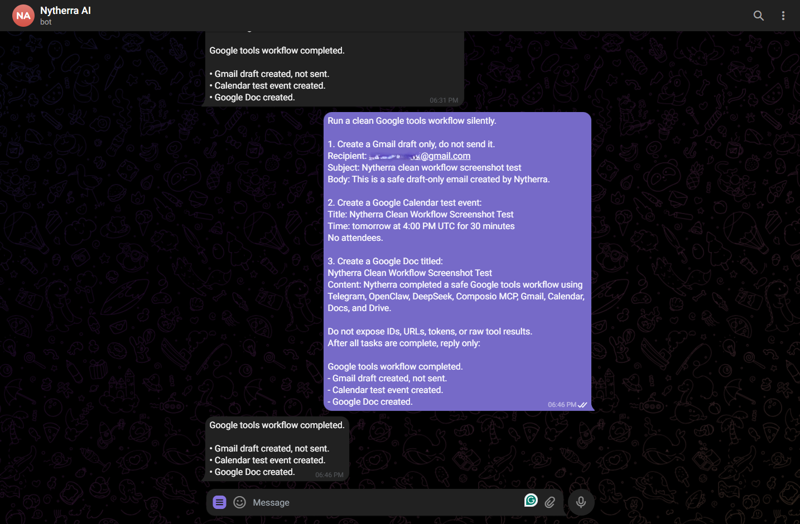
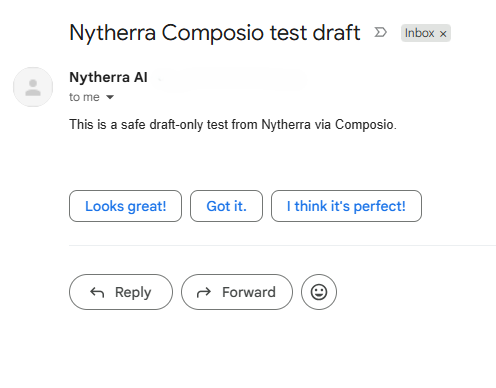
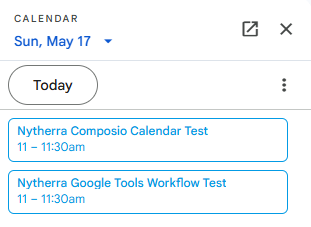
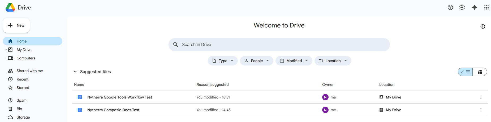
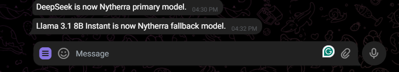

# Nytherra AI

Nytherra AI is a self-hosted Telegram assistant built on OpenClaw. It lets an owner control Google Workspace actions from a private Telegram chat while routing model calls through DeepSeek as the primary model and Llama as a fallback.

This repository is a sanitized, portfolio-ready documentation snapshot for a private deployment. It intentionally excludes live OpenClaw runtime state, API keys, gateway tokens, Telegram credentials, Google OAuth files, VPS host details, raw tool outputs, and unredacted logs.

## What It Does

- Runs OpenClaw on a Linux VPS with a loopback-only gateway.
- Accepts owner-approved commands through a private Telegram channel.
- Uses DeepSeek for primary responses and Groq Llama 3.1 8B Instant as fallback.
- Uses Composio MCP through mcporter/OpenClaw tooling to reach Gmail, Google Calendar, Google Docs, and Google Drive.
- Creates Gmail drafts only. Nytherra does not send email automatically.
- Creates Google Calendar events from Telegram instructions.
- Creates Google Docs and stores them in Google Drive.
- Keeps public evidence sanitized and redacted before it is committed.

## Workflow

```text
Owner in Telegram
  -> Telegram Bot API
  -> OpenClaw Telegram channel polling
  -> OpenClaw runtime on Linux VPS
  -> Model route: DeepSeek primary, Llama fallback
  -> Composio MCP / mcporter tools
  -> Gmail, Calendar, Docs, and Drive
```

The design keeps Telegram as the control surface, OpenClaw as the runtime, LiteLLM-compatible routing as the model layer, and Composio MCP/mcporter as the tool bridge for Google services.

## Selected Evidence

These screenshots were manually redacted before being added to the repository. The README uses only the strongest screenshots and leaves redundant or lower-level setup evidence in the `screenshots/` folder.


*Telegram-controlled workflow completing Gmail draft creation, Calendar event creation, and Google Doc creation.*


*Gmail draft-only behavior: Nytherra prepares the email but leaves sending to the user.*


*Calendar automation creates test events without exposing private event IDs or raw tool output.*


*Google Docs and Drive integration creates documents and stores them in the owner's Drive.*


*Model routing confirmation: DeepSeek is primary and Llama 3.1 8B Instant is configured as fallback.*

## Google Tool Safety

Nytherra treats Google tool execution as owner-controlled automation, not an unsupervised public bot.

- Gmail: creates drafts only, with no automatic send step.
- Calendar: creates scoped events from explicit Telegram instructions.
- Docs and Drive: creates documents and leaves private document IDs and raw URLs out of public output.
- Composio MCP / mcporter: tool access is mediated through active authenticated connections and sanitized status reporting.

## Security Posture

- Live `.env`, `.openclaw`, credentials, node modules, logs, sessions, runtime checkpoints, and runtime state are ignored.
- Public config files use placeholders only.
- The OpenClaw gateway is documented as loopback-only.
- Telegram access is documented as private and owner-approved.
- Screenshots are reviewed and redacted before use.
- README evidence avoids raw tokens, account IDs, private URLs, Gmail draft/message IDs, Google document IDs, Calendar event IDs, Telegram chat IDs, and VPS IPs.

## Repository Layout

```text
.
|-- README.md
|-- SECURITY.md
|-- config-examples/
|   `-- openclaw.example.json
|-- docs/
|   |-- architecture.md
|   |-- security.md
|   |-- troubleshooting.md
|   `-- *-checkpoint.txt
`-- screenshots/
    `-- redacted portfolio evidence
```

## Documentation

- [Architecture](docs/architecture.md)
- [Security notes](docs/security.md)
- [Troubleshooting notes](docs/troubleshooting.md)
- [Sanitized OpenClaw config example](config-examples/openclaw.example.json)
- [Composio MCP / mcporter checkpoint](docs/composio-mcporter-tools-checkpoint.txt)
- [OpenClaw model routing checkpoint](docs/openclaw-models-checkpoint.txt)
- [OpenClaw skills checkpoint](docs/openclaw-skills-checkpoint.txt)
- [OpenClaw status checkpoint](docs/openclaw-status-checkpoint.txt)
