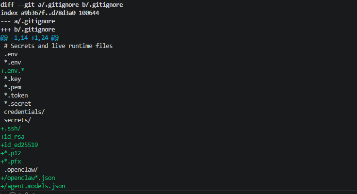

# Security Notes

Nytherra AI is configured with a security-first baseline for the initial deployment.

## Current Security Decisions

- The OpenClaw gateway is bound to loopback.
- The gateway is not exposed directly to the public internet.
- Token-based gateway authentication is enabled.
- Live runtime configuration files are excluded from the GitHub project.
- API keys, gateway tokens, and credentials are not committed.
- Public documentation uses sanitized configuration examples only.

## Secret Handling

The following should never be committed to GitHub:

- API keys
- Gateway tokens
- SSH keys
- Environment files
- Live OpenClaw configuration files
- Checkpoint backups
- Screenshots that reveal secrets

## Screenshot Policy

Screenshots should be reviewed before being added to the repository. Any visible token, API key, host credential, or private terminal history should be blurred, cropped, or replaced with a clean screenshot.

*Repository hardening for runtime files, credentials, checkpoints, and local OpenClaw artifacts.*

## Pre-Submission Security Checklist

Before final portfolio submission:

- Regenerate the OpenClaw gateway token.
- Rotate any exposed or reused credentials.
- Review screenshots for secrets.
- Confirm .gitignore is active.
- Confirm no live config files are staged in Git.
- Run a final security review.

## Future Hardening

Possible future hardening steps include:

- Configure a command owner before enabling external channels.
- Add Telegram only after owner permissions are configured.
- Use least-privilege access for channels and tools.
- Avoid public gateway exposure unless secured behind an authenticated proxy.
- Keep model and provider credentials separate from the repository.
